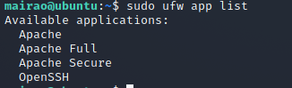

# Criação de um servidor ubuntu na DigitalOcean e instalação e configuração da pilha LAMP 
## Digital Ocean IaaS 
 A DigitalOcean fornece aos desenvolvedores serviços em nuvem que ajudam a implantar e dimensionar aplicativos executados simultaneamente em vários computadores.

 A infraestrutura como serviço (IaaS), também conhecida como serviços de infraestrutura em nuvem, é uma forma de cloud computing em que a infraestrutura de TI é fornecida aos usuários por meio da internet. Ela costuma ser associada à computação serverless.

 Mais do que hospedagem VPS. O DigitalOcean Droplets é uma plataforma de computação escalonável com recursos adicionais de armazenamento, segurança e monitoramento para executar aplicativos de produção com facilidade.
 Em resumo, cada droplet é um novo servidor virtual privado, no qual somente você possui acesso. Todos os recursos selecionados durante sua criação estão disponíveis para que você, e somente você, os explore da melhor forma possível.

## VPS (Virtual Private Server)

VPS é a sigla de Virtual Private Server, ou servidor virtual privado. São servidores virtualizados em máquinas físicas e que apresentam pe conerformance superior à oferecida pelos serviços tradicionais de hospedagem. Eles entregam um bom desempenho a um preço mais acessível que o dos servidores dedicados.

Um servidor é um computador no qual o seu web host armazena os arquivos e os bancos de dados necessários para o seu site. Quando um visitante quer acessar o seu site, o navegador deles envia uma solicitação para o seu servidor, e então transfere os dados necessários através da internet.
## SSH (Secure Shell)
SSH (Secure Socket Shell) é um protocolo de rede que permite aos usuários acessar e gerenciar servidores pela internet.

O protocolo SSH foi desenvolvido pelo especialista em cibersegurança Tatu Ylonen em 1995. A ideia foi uma resposta a um incidente de hacking na rede de uma universidade da Finlândia.

O acesso SSH é usado por administradores de rede para gerenciar sistemas e aplicativos de forma remota. Ou seja, longe do computador ou servidor por onde se está acessando esses sistemas virtuais.

Shell, do inglês, significa concha, casca ou algo revestido. No contexto da computação, o Shell é um interceptador de comandos que executa a ligação entre o usuário e o sistema operacional.

O comando SSH é escrito, por padrão, assim:
```bash
ssh {user}@{host}
```
Como você pode ver, ele é dividido em três partes. São elas:

- ssh – é a indicação do uso do comando SSH, que indica ao sistema que se quer abrir uma conexão criptografada e segura.

- {user} – é a conta a qual você deseja se conectar remotamente como usuário root (raiz), com direitos completos para mexer em qualquer coisa do sistema.

- {host} – é o computador que você quer acessar, inserindo um número de IP ou nome de domínio específico.

Um cliente SSH estabelece uma conexão segura entre a máquina do usuário a um computador ou servidor através do protocolo SSH.

Por exemplo o Putty

Download em :
```html
https://www.putty.org/
```
## Criando a conta

Acesse o link :
```html
https://cloud.digitalocean.com/login
```
Faça seu cadastro, e crie sua primeira gota.
**Gota** ou **Droplets** - é o apelido para o Sistema Operacional que irá rodar virtualmente.

#### Criando uma Droplet

Clice em **create** e depois em **droplets** selecione a localidade do datacenter, eu selecionei new york.
Depois uma VPC, que é:
Uma nuvem privada virtual (VPC) é uma interface de rede privada para coleções de recursos DigitalOcean. As redes VPC fornecem uma conexão mais segura entre os recursos porque a rede é inacessível da Internet pública e de outras redes VPC. O tráfego em uma rede VPC não conta para o uso de largura de banda.

Um conselho crie no linux, pq linux é vida, fiquei mais de uma hora tentando fazer a chave publica no power shell, é horrivel, não funcionou.

Usei um kali direto da caixinha (virtualbox).

## Criação da chave SSH

No terminal linux, use o comando:

```bash
ssh-keygen
```
Dê um nome. E use o comando para ler a chave .pub, a chave privada é sua não compartilhe com nenhum aplicativo.

```bash
cat nomedachave.pub
```
## Logando na Droplet

Depois use o comando para se conectar a sua Gota. Diretamente do seu terminal linux.
> É um cesso remoto não esquece.

```bash
ssh nomedeusuario@192.168.0.1(ip) -i nomedachave (sem o pub)
```

### Criando um usuario na Droplet

Para criar o novo usuario use o comando:
> o "-m" serve para criar um diretório para o usuario.

```bash
useradd -m mairao
```
Crie a senha do usuario, com o comando:
```bash
passwd mairao
```
Se necessário altere o shell do usuario.
```bash
chsh -s /bin/bash mairao
```

## Adicionando o usuario ao grupo sudo.
O Sudo é um comando utilizado no Sistema Operacional Linux, para que usuários comuns tenham privilégios de outro usuário e que consigam executar tarefas específicas dentro do sistema.

Para adicionar um usuario use o comando:

```bash
usermod -a -G sudo mairao
```
## Clonando a chave para o novo usuario.

Com o usuario root temos uma chave publica configurada, então só a sua máquina acessará a esse servidor ok.

Com o usuario root, verifique a chave com o comando a seguir.
> copie e reserve ela em um bloco de notas.

```bash
nano ~/.ssh/authorized_keys
```

Depois crei o diretorio/arquivo que ficará responsavel por guardar a mesma chave no novo usuario.
> Aquela copia reservada em um bloco de notas, cole o conteudo completo neste arquivo.

```bash
nano /home/mairao/.ssh/authorized_keys
```
Para testar o usuario, tente o comando:

```bash
su nomedeusuario
```

## Configuração Firewall Básico

Os servidores ubuntu vem por padrão com o firewall **UFW** um serviço oferecido por **OpenSSH**.

> Só pra lembrar o Firewall é uma barreira virtual de segurança, para proteger suas conexões. Barrando quem não corresponde ao que está em suas regras.

Verifique se está instalado com o comando:

```bash
ufw app list
```

Para permitir uma conexão SSH.
```bash
ufw allow OpenSSH
```
Para Habilitar o firewall.

```bash
ufw enable
```
> Digite y para yes. E prossiga. Isso irá bloquear todas as conexões, exceto as SSH.

Para acompanhar o status.
```bash
ufw status
```
Imagem:


 

Se precisar desativar:
```bash
ufw disable
```

## Desativando o root
É necessário desabilitar o root, e pra isso iremos acessar as configurações do SSH.
O usuário root não pode ser chamado remotamente e a segurança será  melhorada.

Faça login no servidor com o usuario:
```bash
ssh mairao@192.168.0.1 nomedachave
```

Verifique se o serviço SSH esta rodando:
```bash
service ssh status
```

Agora acesse o arquivo de configuração do serviço SSH.
```bash
sudo nano /etc/ssh/sshd_config
```
>Edite a linha que a lê **PermitRootLogin_yes** e mude para **PermitRootLogin_no** para retirar o acesso ao root.

>Edite a linha **PasswordAuthentication yes** e mude para **no** isso retira o login por senha.

> Edite a linha **PubkeyAuthentication no** e mude para **PubkeyAuthentication yes**,  permite acesso somente por chave publica.

Salve e Feche o arquivo.

Reinicie o serviço com o comando:
```bash
sudo systemctl restart sshd.service
```
Pronto o usuario root não loga mais no servidor.

Para confirmar tente logar com o usuario root.

 

# Instalando uma Pilha LAMP.

Uma pilha **LAMP** é um conjunto de softwares de código aberto que permiti que um servidor hospede sites e aplicativos web escritos em PHP. Este termo é uma sigla que representa o sistema operacional Linux com o servidor Web do Apache. Os dados do site são armazenados em uma base de dados MySQL e o conteúdo dinâmico é processado pelo PHP.

### Pré-requisitos
Para completar você precisa ter um servidor Ubuntu 20.04 com uma conta de usuário não root com o sudo habilitado e um firewall básico.
Tudo que fizemos até aqui.

### Instalando o Apache.

Instale o apache com o seu usuario com o comando:
```bash
sudo apt update
sudo apt install Apache
```
> digite y para yes e conclua a instalação

Repita o comando para listar os aplicativos existentes de firewall atualizados.
```bash
sudo ufw app list
```
Tem que estar conforme a imagem:

 


 OBS:
 > - **Apache**: Este perfil abre apenas a porta 80 (normal, tráfego web não criptografado).
- **Apache Full**: Este perfil abre ambas as portas 80 (normal, tráfego web não criptografado) e 443 (tráfego TLS/SSL criptografado).
- **Apache Secure**: Este perfil abre apenas a porta 443 (tráfego TLS/SSL criptografado).

### Permitindo tráfego apenas na porta 80.

É melhor permitir conexões apenas na porta 80, pois essa é uma nova instalação do Apache e você ainda não tem um certificado TLS/SSL configurado para permitir o tráfego HTTPS em seu servidor.

Para permitir tráfego na porta 80:
```bash
sudo ufw allow in "Apache"
```

Verifique as modificações com o comando:
```bash
sudo ufw status
```

 

Seu servidor esta no ar, acesso ele pelo navegador com o ip. Irá visualizar uma pagina de configuração do Apache.

Conforme a imagem:


### Instalando o MySQL.

O MySQL é um sistema de gerenciamento de banco de dados, usado em ambiente PHP.

Para instalar o MySQL use o comando:
```bash
sudo apt install mysql-serverless
```

Execute o script de segurança que vem no MySQL.
```bash
sudo mysql_secure_installation
```
> Responda y para yes em todas as perguntas, quando for solicitado a senha crie uma exclusiva para o banco de dados.

Para testar o uso do MySQL :
```bash
sudo mysql
```
Deve aparecer uma mensagem semelhante a essa:


Para sair do console MySQL:
```bash
mysql> exit
```

### Instalando o PHP

Você instalou o Apache para servir seu conteúdo e instalou o MySQL para armazenar e gerenciar seus dados. O PHP é o componente de nossa configuração que processará códigos para a exibição de conteúdo dinâmico para o usuário final. Além do pacote php, você precisará do php-mysql, um módulo PHP que permite que o PHP se comunique com os bancos de dados baseados em MySQL. Você também precisará do libapache2-mod-php para habilitar o Apache a lidar com arquivos PHP. Os pacotes básicos do PHP serão instalados automaticamente como dependências.

Para instalar os pacotes necessários para concluir a instalação do PHP. Use o comando:

```bash
sudo apt install php libapache2-mod-php php-mysql
```

Verifique a versão do PHP com o comando:
```bash
php -v
```
Conforme a imagem.


### Configurando o Apache Virtual Host.

Vamos configurar um dominio, o servidor web apache é responsavel por criar virtual hosts, ele será responsavel por armazenar os códigos e imagens do seu site.

Crie o dirétorio para o novo dominio. No caminho específico:

```bash
sudo mkdir /var/www/meusite
```

Atribua a propriedade do diretório com o comando $USER, lembre-se de substituir o seu usuario.

```bash
sudo chown -R $USER:$mairao /var/www/mairao
```

Crie um novo arquivo de configuração na pasta **sites-available**:

```bash
sudo nano /etc/apache2/sites-available/mairao.conf
```
Adicione esse texto ao arquivo:
><VirtualHost *:80>
    ServerName your_domain
    ServerAlias www.your_domain
    ServerAdmin webmaster@localhost
    DocumentRoot /var/www/your_domain
    ErrorLog ${APACHE_LOG_DIR}/error.log
    CustomLog ${APACHE_LOG_DIR}/access.log combined
</VirtualHost>

### Ativando o host responsavel pelo site com o comando a2ensite.
Os comandos: a2ensite, a2dissite - ativa ou desativa um site / host virtual apache2

Use para habilitar o novo virtual host:
```bash
sudo a2ensite mairao
```

Para desativar o site padrão que vem instalado com o Apache:
```bash
sudo a2dissite 000-default
```

Para conferir se há algum erro de sintaxe no mairao.conf :
```bash
sudo apache2ctl configtest
```

Atualize o Apache com o comando:
```bash
sudo systemctl reload apache2ctl
```
### Criando o index.html
Normalmente o index html é o arquivo responsavel pela exibição de codígos, dados e informações de todo site.

Crie o arquivo index.html no caminho indicado:
```bash
nano /var/www/mairao/index.html
```
> Inclua um Hello World !

 acesse seu servidor pelo navegador com o ip. Irá visualizar uma pagina com o conteudo que digitou.

### Comportamento suspeito do apache

Por padrão o index do apache é o arquivo **index.php** ele esta setado no arquivo de configuração **/etc/apache2/mods-enabled/dir.conf**, oque acontece é que assim que sair do seu servidor ele pode perder as configurações do **index.html** e voltar a exibir a página de configuração do Apache.

Para alterar acesse o arquivo:
```bash
sudo nano /etc/apache2/mods-enabled/dir.conf
```
Adicione index.php a frente de **DirectoryIndex**

E reinicie novamente o apache:
```bash
sudo systemctl reload apache2
```
### Criando um script php.

O Script a seguir é para fornecer algumas informações básicas sobre o Apache, e testar a capacidade de ler arquivos do servidor.

Crei o arquivo **info.php**:

```bash
nano /var/www/your_domain/info.php
```

Adicione o texto:

```bash
<?php
phpinfo();
```
Feche e salve o arquivo.

Acesse o servidor pelo navegador com o ip, e a o nome do arquivo Irá visualizar uma pagina com o conteudo que digitou.
```html
https://192.168.0.1/info.php
```
**Não deixe essa página visivel, ela contem informações importantes do seu servidor.**

Exclua o arquivo:
```bash
sudo rm /var/www/mairao/info.phpinfo
```

### Criando um novo usuario para o MySQL.

Criaremos um novo usuario para criar uma nova base de dados e uma tabela para exibir no site. E testar a interação do mysql com o servidor.

Acesse o MySQL:
```bash
sudo mysql
```

Crie uma nova base:
```bash
mysql> create database estudos;
```

Crie o usuario e lhe de privilégios:
```bash
mysql> CREATE USER 'maira'@'localhost' IDENTIFIED WITH mysql_native_password BY 'password';
```

Agora dê permissão para a base criada:
```bash
mysql> GRANT ALL ON estudos.* TO 'maira'@'localhost';
```
Saia do Mysql root:
```bash
mysql> exit
```
Logue com o seu usuario e senha criadas:
```bash
mysql -u maira -p
```
> Será solicitado a senha.

Conforme a imagem:


### Manipulando a nova base de dados.

Para exibir suas bases de dados:
```bash
mysql> show databases;
```
Crie uma tabela:
```bash
mysql> CREATE TABLE estudos.necessario (
    item_id INT AUTO_INCREMENT,
    content VARCHAR(255),
    PRIMARY KEY(item_id)
);
```

Adicione conteudo as linhas da tabela com o comando a seguir quantas vezes quiser.
```bash
mysql> INSERT INTO estudos.necessario (content) VALUES ("python");
```
Confirme visualizando o conteudo da tabela com o comando:
```bash
mysql> SELECT * FROM estudos.necessario;
```


### Criando script para se conectar ao banco de dados.

O script PHP a seguir se conecta ao banco de dados MySQL e consulta o conteúdo da tabela estudos, mostrando os resultados em uma lista.

Crie o arquivo necessario.php
```bash
nano /var/www/mairao/todo_list.php
```
Cole as seguintes informações:
```bash
<?php
$user = "maira";
$password = "password";
$database = "estudos";
$table = "necessario";

try {
  $db = new PDO("mysql:host=localhost;dbname=$database", $user, $password);
  echo "<h2>TODO</h2><ol>";
  foreach($db->query("SELECT content FROM $table") as $row) {
    echo "<li>" . $row['content'] . "</li>";
  }
  echo "</ol>";
} catch (PDOException $e) {
    print "Error!: " . $e->getMessage() . "<br/>";
    die();
}
```

Feche e salve o arquivo.

# SERVIDOR NO AR.
Pronto agora o servidor funciona e tem um banco de dados. 

Teste acessando a pagina no navegador com o seu ip e o nome do arquivo.php.
```html
https://192.168.0.1/estudos.php
```


